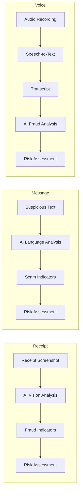

# SafePay AI — AI Fraud Shield for Digital Payments

AI-powered fraud awareness platform for digital payments in Pakistan. Upload a suspicious receipt screenshot, paste a scam message, or upload a voice call recording — SafePay AI analyzes it for fraud indicators, assigns a risk level, explains the reasoning in plain English or Urdu, and recommends a safe action.

### [Live Demo → safe-pay-ai-rho.vercel.app](https://safe-pay-ai-rho.vercel.app/)

> **Disclaimer:** SafePay AI provides AI-generated risk awareness only. It does **not** officially verify transactions, guarantee fraud detection, or replace your bank, wallet provider, or law enforcement.

---

## Key Features

| Feature | Description |
|---------|-------------|
| **Receipt Risk Analyzer** | Upload a payment receipt screenshot — AI inspects it for tampered amounts, fake merchants, format inconsistencies |
| **Scam Message Analyzer** | Paste a suspicious SMS or WhatsApp message — AI detects phishing links, urgency tactics, impersonation |
| **Voice Scam Analyzer** | Upload a call recording — AI transcribes it and identifies impersonation and pressure tactics |
| **Bilingual Support** | Full English + Urdu (اردو) interface with proper RTL/LTR text direction |
| **Dark Mode** | System-aware light/dark theme with smooth transitions |
| **Privacy First** | Files are analyzed in real-time and never stored; no user data is persisted |
| **Responsive UI** | Works on desktop, tablet, and mobile |

---

## How It Works



Each analyzer returns:

- **Risk Level** — Low, Medium, High, or Critical
- **Risk Score** — 0–100 numeric score
- **Threat Category** — type of scam detected
- **Warning Signs** — specific fraud indicators found
- **Explanation** — plain-language reasoning
- **Safety Recommendation** — what to do next

---

## Architecture

```
┌─────────────────────┐     HTTP/REST      ┌─────────────────────┐     HTTPS       ┌───────────────────────┐
│                     │ ──────────────────► │                     │ ──────────────► │                       │
│   Frontend          │                     │   Backend           │                 │  Alibaba DashScope    │
│   Next.js / React   │ ◄────────────────── │   FastAPI / Python  │ ◄────────────── │  Qwen AI Models       │
│   Port 3000         │                     │   Port 8000         │                 │                       │
└─────────────────────┘                     └─────────────────────┘                 └───────────────────────┘
```

| Layer | Tech | Role |
|-------|------|------|
| **Frontend** | Next.js 16, React 19, TypeScript, Tailwind CSS 4 | UI, file uploads, result display |
| **Backend** | Python FastAPI, Uvicorn, Pydantic | Receives uploads, calls AI models, returns structured JSON |
| **AI Layer** | Alibaba Cloud DashScope (Qwen-VL-Plus, Qwen3-ASR-Flash) | Vision analysis, text analysis, speech-to-text |

### AI Models

| Module | Model | Purpose |
|--------|-------|---------|
| Receipt Analyzer | `qwen-vl-plus` | Vision analysis of receipt screenshots |
| Message Analyzer | `qwen-vl-plus` | Text-based scam pattern detection |
| Voice Analyzer | `qwen3-asr-flash` | Speech-to-text transcription |
| Voice Analyzer | `qwen-vl-plus` | Fraud analysis of transcribed text |

---

## Project Structure

```
├── backend/
│   ├── app/
│   │   ├── main.py              # FastAPI app, CORS, health endpoint
│   │   ├── config.py            # Pydantic Settings (env vars)
│   │   ├── routers/
│   │   │   ├── receipt.py       # POST /api/receipt/analyze
│   │   │   ├── message.py       # POST /api/message/analyze-text
│   │   │   └── voice.py         # POST /api/voice/analyze
│   │   ├── services/
│   │   │   └── dashscope.py     # DashScope AI integration
│   │   └── models/
│   │       └── schemas.py       # Pydantic response models
│   ├── run.py                   # Server entry point (Uvicorn)
│   ├── requirements.txt         # Python dependencies
│   └── .env.example
├── frontend/
│   ├── src/
│   │   ├── app/
│   │   │   ├── layout.tsx       # Root layout (Header, Footer, providers)
│   │   │   ├── page.tsx         # Home page
│   │   │   ├── receipt/         # Receipt analyzer page
│   │   │   ├── message/         # Message analyzer page
│   │   │   └── voice/           # Voice analyzer page
│   │   ├── components/          # Shared UI components
│   │   └── lib/
│   │       ├── api.ts           # API client
│   │       ├── mock.ts          # Demo-mode sample results (fallback when backend is unreachable)
│   │       ├── LanguageContext.tsx  # Global language state (EN/UR)
│   │       └── ThemeContext.tsx    # Dark mode state
│   ├── package.json
│   └── .env.example
└── README.md
```

---

## Getting Started

### Prerequisites

- **Python** 3.11+
- **Node.js** 20.9+ (required by Next.js 16)
- An Alibaba Cloud DashScope API key ([get one here](https://dashscope.console.aliyun.com/))

### 1. Clone the Repository

```bash
git clone https://github.com/Tayyaba-Amin/SafePay-AI.git
cd SafePay-AI
```

### 2. Backend Setup

```bash
cd backend

# Create a virtual environment
python -m venv venv

# Activate it
# Windows PowerShell:
.\venv\Scripts\Activate.ps1
# macOS/Linux:
source venv/bin/activate

# Install dependencies
pip install -r requirements.txt

# Create your .env file from the template
copy .env.example .env        # Windows
# cp .env.example .env        # macOS/Linux

# Edit .env and add your DashScope API key
# DASHSCOPE_API_KEY=sk-xxxxxxxxxxxx
```

### 3. Frontend Setup

```bash
cd frontend

# Install dependencies
npm install

# Create your .env file from the template
copy .env.example .env        # Windows
# cp .env.example .env        # macOS/Linux
```

### 4. Run Locally

**Terminal 1 — Backend:**

```bash
cd backend
.\venv\Scripts\Activate.ps1    # Windows PowerShell
# source venv/bin/activate     # macOS/Linux
python run.py
```

> Backend runs at **http://localhost:8000** — API docs at **http://localhost:8000/docs**

**Terminal 2 — Frontend:**

```bash
cd frontend
npm run dev
```

> Frontend runs at **http://localhost:3000**

---

## Environment Variables

### Backend (`backend/.env`)

| Variable | Description | Default |
|----------|-------------|---------|
| `DASHSCOPE_API_KEY` | Alibaba Cloud DashScope API key | *(required)* |
| `BACKEND_HOST` | Server bind host | `0.0.0.0` |
| `BACKEND_PORT` | Server port | `8000` |
| `CORS_ORIGINS` | Comma-separated allowed origins | `http://localhost:3000` |
| `MAX_UPLOAD_SIZE` | Max upload file size (bytes) | `10485760` (10 MB) |

### Frontend (`frontend/.env`)

| Variable | Description | Default |
|----------|-------------|---------|
| `NEXT_PUBLIC_API_URL` | Backend API base URL | `http://localhost:8000` |

> **Important:** Do **not** add a trailing slash to the URL — the API client concatenates it directly with endpoint paths, so a trailing slash produces broken double-slash URLs (`...com//api/...`).
>
> Production example: `NEXT_PUBLIC_API_URL=https://safepay-ai-backend.onrender.com`

---

## API Endpoints

| Method | Path | Description |
|--------|------|-------------|
| `GET` | `/health` | Health check |
| `POST` | `/api/receipt/analyze` | Analyze a receipt screenshot (`multipart/form-data`) |
| `POST` | `/api/message/analyze-text` | Analyze a pasted text message (`application/json`) |
| `POST` | `/api/message/analyze` | Screenshot-based message analysis — *not yet implemented (returns 501)* |
| `POST` | `/api/voice/analyze` | Analyze a voice recording (`multipart/form-data`) |

---

## Usage

1. **Open** [https://safe-pay-ai-rho.vercel.app/](https://safe-pay-ai-rho.vercel.app/) in your browser (or `http://localhost:3000` if running locally)
2. **Choose a language** — English or اردو — using the selector in the header
3. **Select an analyzer:**
   - **Receipt** — Upload a payment receipt screenshot (JPEG, PNG, WebP)
   - **Message** — Paste a suspicious SMS or WhatsApp message (10–5000 characters)
   - **Voice** — Upload an audio recording of a suspicious call
4. **Review the result:**
   - Risk level and score
   - Warning signs detected
   - Explanation of the risk
   - Recommended safe action
5. **Switch language** at any time — results update immediately

> **Note:** If the backend is unreachable, the Message and Receipt analyzers fall back to a clearly-labeled **demo mode** showing sample results; the Voice analyzer shows the backend error instead. Connect the backend with a valid `DASHSCOPE_API_KEY` for real AI analysis.

---

## Risk Assessment

| Level | Score Range | Meaning |
|-------|------------|---------|
| **Low** | 0–25 | No obvious scam indicators detected |
| **Medium** | 26–50 | Some suspicious elements found — exercise caution |
| **High** | 51–75 | Multiple fraud indicators — very likely a scam |
| **Critical** | 76–100 | Textbook scam pattern — immediate danger |

> Risk assessments are AI-generated and may contain errors. Always independently verify important payment information through your bank or wallet provider's official channels.

---

## Security & Privacy

- **API keys** are stored only in `backend/.env` and never exposed to the frontend
- **`.env` files** are gitignored — real secrets are never committed
- **File uploads** are validated for type and size; processed in memory only
- **No data stored** — files, transcripts, and analysis results are never persisted
- **No credentials requested** — the application never asks for OTPs, PINs, passwords, or account numbers

---

## Limitations

- AI models can make mistakes — false positives and false negatives are possible
- Risk assessment is an awareness tool, **not** a guarantee of fraud detection
- SafePay AI does not replace official verification from banks, wallet providers, or law enforcement
- Voice transcription accuracy depends on audio quality and clarity
- The system is designed for the Pakistani digital payments context (JazzCash, Easypaisa, HBL, UBL, etc.)
- Users should always independently verify suspicious transactions through official channels

---

## Future Improvements

- Real-time scam detection with streaming analysis
- Additional language support (Sindhi, Pashto, Punjabi)
- Broader payment platform coverage beyond Pakistan
- Integration with local fraud-reporting systems
- User feedback loop to improve model accuracy
- Continuous evaluation against known scam datasets
- Offline-capable mobile application

---

## Hackathon Context

SafePay AI was built as a hackathon project focused on **financial inclusion and safer digital payments**. The project addresses a growing problem: as digital payment adoption increases in Pakistan, so does the volume and sophistication of payment scams — particularly targeting users who may be less familiar with digital fraud patterns.

The bilingual English/Urdu interface is intentional: it ensures the tool is accessible to the widest possible audience in Pakistan, including users who may be most vulnerable to scams.

---

## License

License to be determined. This is a hackathon MVP project.
